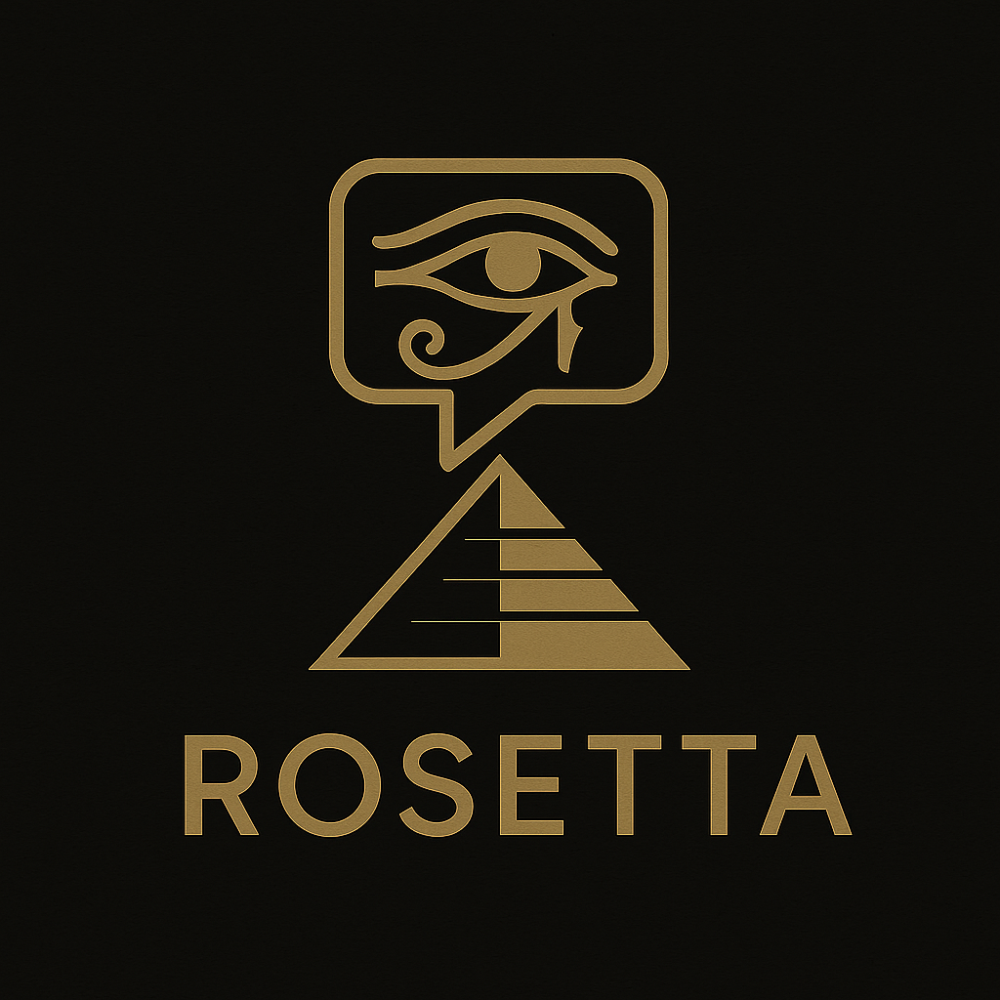
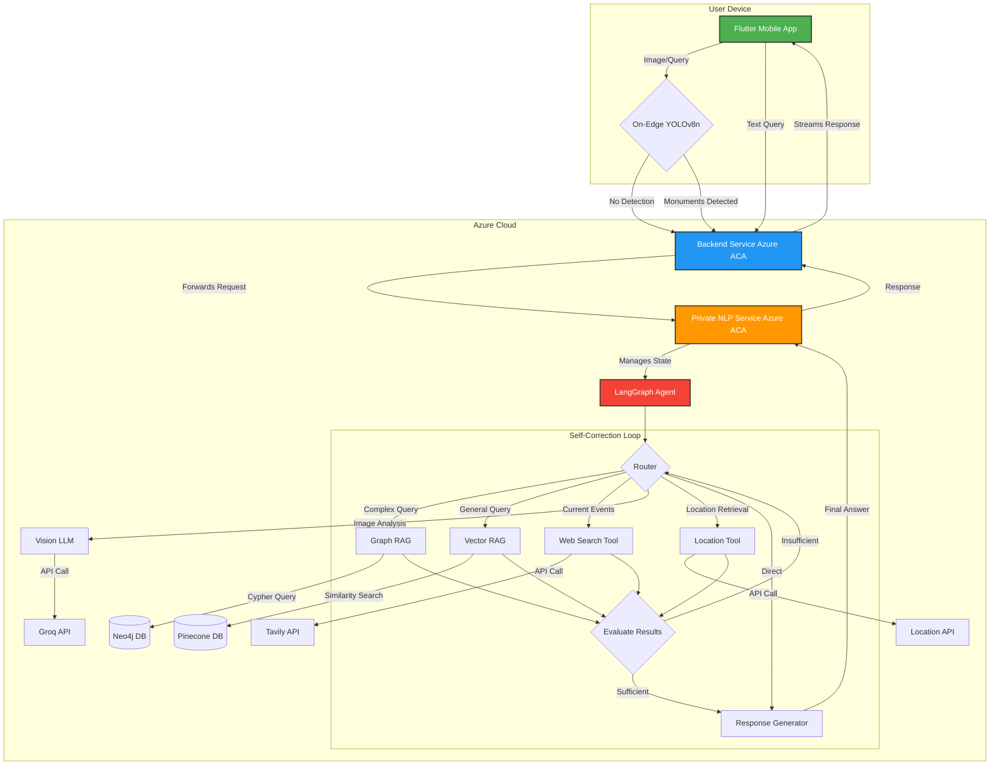

# Rosetta AI tour Guide
- (Demo Link) [https://drive.google.com/file/d/1h9tYAx3HzBwT7fFh9Gg7cxUrLyh8ScoS/view?usp=sharing]

---

  

  <strong>Instantly identify Egyptian monuments and get answers to your historical questions through an advanced, conversational AI.</strong>

  
  
  
  

---

Rosetta is an AI-powered mobile application designed to bridge the gap between curiosity and knowledge for Egyptian cultural heritage. It addresses the need for accessible cultural education by replacing the limitations of traditional tour guides (cost, time, hassle) with an intelligent, interactive digital assistant. Simply take a picture of a monument or ask a question, and let Rosetta guide you through history.

## ✨ Key Features

- **📸 Instant Monument Identification**: A lightweight, on-device **YOLOv8n** model instantly recognizes 84 different Egyptian monuments and artifacts from an image.
- **🗣️ Conversational Q&A**: Go beyond simple identification. Ask complex, follow-up questions in natural language and receive detailed, context-aware answers.
- **🧠 Advanced Agentic Workflow**: Powered by **LangGraph**, the backend agent can reason, choose the best tool for your query, and even self-correct if its initial approach is insufficient.
- **📚 Multi-Source Knowledge Base**: The agent pulls information from multiple sources to provide the best answer:
  - **Graph Database (Neo4j)** for complex, relational historical queries.
  - **Vector Database (Pinecone)** for general context and semantic search.
  - **Live Web Search (Tavily)** for questions outside its curated knowledge.
  - **Location-Based Context**: Uses GPS to provide relevant information based on your current location.
- **🔍 Self-Correcting Mechanism**: If the agent's initial response isn't satisfactory, it can re-evaluate and refine its approach, ensuring you get the most accurate information.
- **🖼️ Intelligent Image Analysis**: If the on-device model can't identify a monument, a powerful Vision-LLM (**Groq**) analyzes the image to provide a description, ensuring you always get a helpful response.
- **⚡ Real-time Streaming**: A streaming API endpoint provides a smooth, real-time "typing" experience in the app, enhancing user engagement.

## 🏛️ System Architecture

The Rosetta system is composed of several microservices that work in harmony to deliver a seamless user experience. The architecture is designed for scalability, security, and performance.

## 🛠️ Technical Stack

| Category            | Technology                                                                 |
|---------------------|----------------------------------------------------------------------------|
| Frontend            | Flutter                                                                    |
| Computer Vision     | YOLOv8n, PyTorch, Albumentations, rembg                                    |
| Backend             | Python 3.9+, FastAPI                                                       |
| NLP & Agent         | LangChain, LangGraph, Groq API                                             |
| Databases           | PostgreSQL (User Data), Neo4j (Knowledge Graph), Pinecone (Vector Store)   |
| DevOps/Deployment   | Docker, Azure Container Apps (ACA)                                         |
| External APIs       | Tavily AI (Web Search)                                                     |

## ⚙️ How It Works: The Agentic Brain

The core of Rosetta is its sophisticated NLP service, which runs a stateful agent built with LangGraph. Here’s a step-by-step breakdown of its reasoning process:

1. **Input Processing:** The agent receives the request, which can contain a text query, detected monument names, a raw image, and chat history. It determines the response_type (e.g., text-only, monument-focused, or image analysis).

2. **Image Analysis (Conditional):** If a raw image is provided, a Vision-LLM is used to generate a text description, providing crucial context for the agent.

3. **Complexity Classification:** The agent uses an LLM to analyze the query and classify it, deciding which tool is best suited to answer it (Graph RAG, Vector RAG, or Web Search).

4. **Query Refinement:** The user's query is rewritten to be more detailed and optimized for the chosen retrieval tool. It's enriched with context from chat history and any image/monument data.

5. **Tool Execution & The Self-Correction Loop**:
    - The agent executes the chosen tool (e.g., queries the Neo4j graph).
    - Crucially, it then evaluates the results. An LLM checks if the retrieved information is sufficient to answer the user's question.
    - If the results are insufficient, the agent removes the failed tool from its list of options and loops back to the classification step to try a different tool. This ensures it doesn't give up after one failed attempt.

6. **Response Generation:** Once sufficient information is gathered (or max retries are reached), the agent synthesizes all the context—original query, chat history, and retrieved data—into a final prompt and generates a coherent, helpful answer.

7. **Memory Management:** The final conversation turn is saved to a memory buffer, which is summarized when it grows too long to manage token limits effectively.

---

## Team Members

- **Omar Younis** - [GitHub](https://github.com/oyounis19)
- **Khaled Ashraf** - [GitHub](https://github.com/khaaaleed-5)
- **Abdullah Hamdi** - [GitHub](https://github.com/AbdullaAlshayeb)
- **Omar Adbelnasser** - [GitHub](https://github.com/Omar2002po)
- **Ali Eldeep** - [GitHub](https://github.com/Eldeep1)
- **Ahmed Lotfy** - [GitHub](https://github.com/Ahmed-Ebrahim-23)

## 🙏 Acknowledgements

This project would not have been possible without the incredible open-source communities behind these technologies:

- LangChain & LangGraph
- FastAPI
- Neo4j
- Pinecone
- And many more

Special thanks to our supervisors and the entire team for their support and collaboration.
